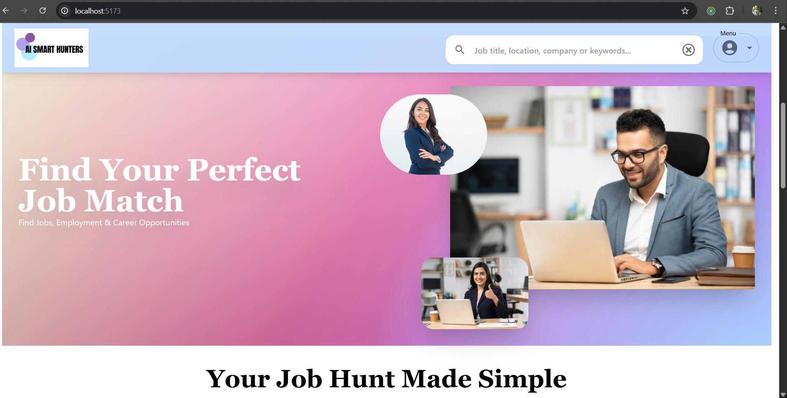
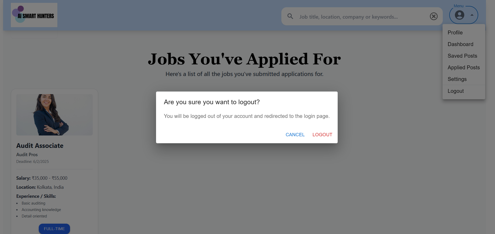
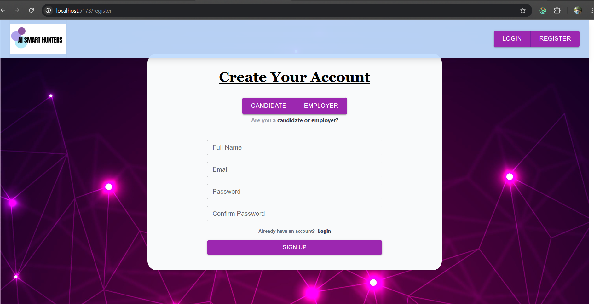

# 💼 Job Portal

A full-featured Job Portal where users can register, login, search for jobs, save jobs, apply directly, and logout. Employers can post jobs, manage applications, and update candidate statuses.  

---

## ✨ Features
- 🔑 **Authentication** – Register, Login & Logout
- 🔍 **Search & filter jobs** by title, location, and category
- ⭐ **Save & apply for jobs** instantly
- 🏢 **Employer Dashboard** – Post and manage job listings
- 📊 **Application tracking** for users
- ✅ **Employer can update candidate status** (Approved / Rejected)
- 🔒 **Secure Logout functionality** for all users

---

## 📸 Screenshots

### Homepage
  
*Landing page with featured jobs and search functionality.*

### Job Details
  
*Detailed job description with Apply option.*

### Employer Dashboard
  
*Employers can create and manage job postings.*

### Candidate can logOut
  
*Secure Logout functionality. *

### Register Page
  
*New users can create an account to apply for jobs.*

### Save Job
  
*Users can save jobs for later applications.*

---

## 🛠️ Tech Stack
- **Frontend:**  
  - HTML  
  - Tailwind CSS  
  - React.js  
  - TypeScript  
  - Material UI  
  - React Query  

- **Backend :**  
  -  Nest.js  
  - MongoDB  

---

